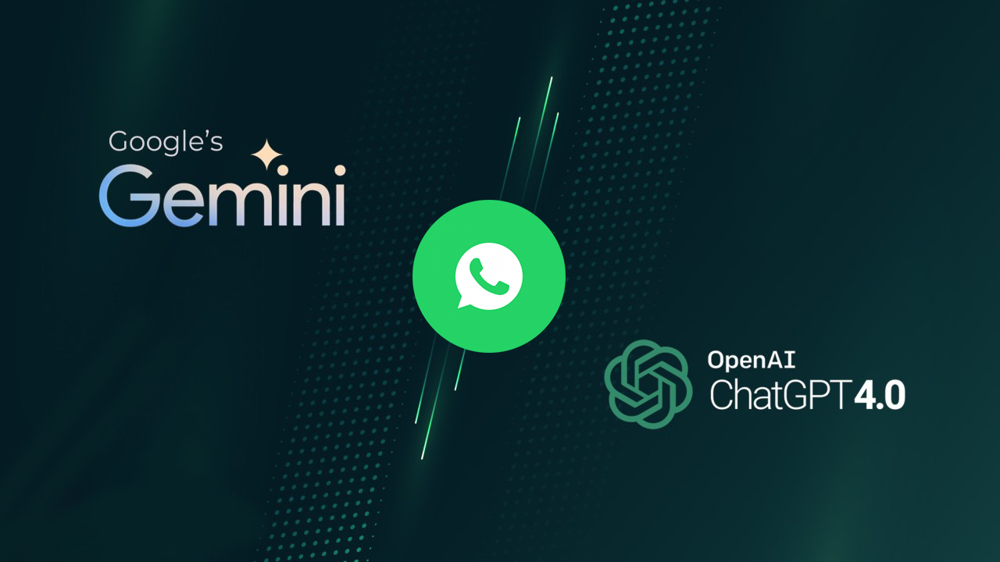

# Whastapp BOT AI V2 (Node)

Whatsapp Bot AI Node Project integrated by OpenAI, Gemini and anymore Feature.  


 
## Installation
```sh
git clone https://github.com/HyTech-Group/wabot-ai-v2.git
cd wabot-ai
npm install
```

## Setting .env
```sh
PHONE = '628xxxxxxx'

API_URL = 'http://localhost:5000'

OPENAI_APIKEY = 'apiKey OpenAI'
MODEL_OPENAI = 'gpt-3.5-turbo-1106'
COMMAND_OPENAI = 'Command the OpenAI'

GEMINI_APIKEY = 'apiKey Gemini'
MODEL_GEMINI = 'gemini-pro'
COMMAND_GEMINI = 'Command the GeminiAI'

PREFIX_OPENAI = '.openai'
PREFIX_GEMINI = '.gemini'
PREFIX_MENU = '.menu'
PREFIX_TRANSLATE_ID = '.en-id'
PREFIX_TRANSLATE_EN = '.id-en'
PREFIX_WIKI_ID = '.wiki-id'
PREFIX_WIKI_EN = '.wiki-en'
PREFIX_IP = '.ip'
PREFIX_SEARCH = '.search'
```

## Run
`node index.js`

## Get ApiKey
<p>Official Site OpenAI: <a href="https://openai.com/">https://openai.com</a>
<br>
Official Site Gemini: <a href="https://aistudio.google.com/">https://aistudio.google.com</a>
<br>
Create Server: <a href="https://github.com/fitri-hy/api-tools-express.git/">https://github.com/fitri-hy/api-tools-express.git</a></p>
<hr/>

<p>Discover more languages <a href="https://www.ibm.com/docs/en/cognos-controller/10.4.2?topic=codes-language">Click Here.</a>
<br>
Don't forget to give stars.</p>

Follow Me: <a href="https://hy-tech.my.id/docs">FOLLOW</a>
